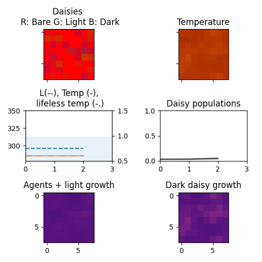

# The RL DaisyWorld

Exploring existential risk in a complex self-regulating ecosystem model. 

## Watson and Lovelock's 1983 daisyworld

Daisyworld [1] is a simple mathematical model designed by Andrew Watson and James Lovelock to demonstrate global regulation of the temperatue on a toy planet without centralized control. In Daisyworld, light and dark daisies affect their own local temperature via a slightly higher or lower albedo than the bare ground or each other. Each type of daisy has the same optimal temperature for growth, and dark daisies absorb more while light daisies reflect more solar energy. Increasing solar radiation is the forcing function in Daisyworld. 

The combined effect of light and dark daisies keeps Daisyworld in the habitable temperature range for life longer than a dead planet or one where daisy albedo matches the albedo of bare ground. Interestingly enough, this can lead to a climate that gets cooler as solar output increases, at least for a while. 


[1] A. J. Watson and J. E. Lovelock, “Biological homeostasis of the global environment: the parable of Daisyworld,” Tellus B, vol. 35B, no. 4, pp. 284–289, Sep. 1983, doi: 10.1111/j.1600-0889.1983.tb00031.x.

## RLDaisyWorld: a 2D Daisyworld with daisy-grazing agents

The RL DaisyWorld is a reinforcement learning environment in the spirit of the original Watson/Lovelock model. RLDaisyWorld is implemented as a continuously-valued cellular automaton on a 2D grid with toroidal topology. The environment introduces agency and an RL API for agents to interact with the environment through rewards, observations, and actions. Agents must maintain an internal state above a survival threshold, and they do so by moving into a grid cell with daisies and adding the total daisy proportion in that cell to their own state, in other words by "grazing" daisies. The agent state is passed to the agent as a reward at each time step. 
For an agent to continue grazing daisies, they must maintain their state above a survival threshold and there must be daisies to consume. Implicitly, the need for sustenance against the daisies' ability to regulate the climate for their own growth must be balanced for agents to maximize accumulated reward. 

<!--
Variations of Daisyworld in 2-dimensions have been implemented in several previous projects. (This list is not comprehensive as of March 2023):

* [Daisyworld in NetLogo](https://www.netlogoweb.org/launch#http://www.netlogoweb.org/assets/modelslib/Sample%20Models/Biology/Daisyworld.nlogo)
-->

## Light and dark daisies extend the habitable lifespan of Daisyworld

When daisies have the same albedo as bare ground DaisyWorld temperature depends on solar forcing, following the same temperature as a lifeless world. In this scenario daisies can only grow for a short period when temperature resides in the habitable range.  


When daisies are lighter (albedo 0.75) and darker (albedo 0.25), they affect the local and global temperature by reflecting more or less stellar radiation than bare ground. The collective effect maintains DaisyWorld temperature in the habitable range earlier and longer than a lifeless world. 



## Greedy agents decrease the habitable lifespan of DaisyWorld

A greedy agent always consumes the cell in the agent's Von Neumann neighborhood with the most daisies. This exploitative strategy decreases the habitable lifespan of DaisyWorld, with the unsurprising consequence that agent lifespan is decreased as well. 


An anti-greedy agent always consumes the neighboring cell with the lowest concentration of daisies. Anti-greedy agents decrease DaisyWorld habitability as well, but not as much as Greedy agents. 


A random agent is less disruptive than either greedy or anti-greedy agents. This is probably because grazing increases daisy growth in nearby cells.


The following summary figure shows the mean lifespans for agents and biosphere. Simulations covered greedy, anti-greedy, random, and half-greedy/half-random strategies, with 1000 simulations for each condition. For this limited set of strategies, DaisyWorld simulations without agents experienced the longest periods with temperatures in the habitable range. A random strategy had slightly shorter habitable periods on average than an anti-greedy strategy, but random agents survived longer. 


```
# error bars are standard deviation / sqrt(number of simulations), i.e an estimate of standard error
greedy_light_and_dark
greedy_light_and_dark mean lifespan: 382.983 +/- 0.722
greedy_light_and_dark mean agent lifespan: 199.024 +/- 5.319

antigreedy_light_and_dark
antigreedy_light_and_dark mean lifespan: 447.099 +/- 0.266
antigreedy_light_and_dark mean agent lifespan: 359.436 +/- 4.228

random_light_and_dark
random_light_and_dark mean lifespan: 416.836 +/- 0.259
random_light_and_dark mean agent lifespan: 408.401 +/- 0.583

half_random_light_and_dark
half_random_light_and_dark mean lifespan: 376.665 +/- 0.372
half_random_light_and_dark mean agent lifespan: 380.428 +/- 0.515

no_light_and_dark
no_light_and_dark mean lifespan: 489.000 +/- 0.000
(no agents)
```

With neutral albedo daisies the lifespan of the biosphere is much shorter. Greedy and anti-greedy strategies don't seem to truncate the habitable period in this scenario, but the agent longevity is decreased relative to random or half-random strategies. 


## Quick start

RLDaisyWorld is a work-in-progress, but you can tinker with it if you want. The setup example is for a linux setup using `virtualenv` as the virtual environment manager, some adaptation may be needed for systems that are set up differently. 

You'll need to install `libopenmpi-dev if you'd like to use the evolutionary baselines for training agents. MPI is used to orchestrate multiple instances of DaisyWorld in parallel to train a population of agents.

```
sudo apt update
sudo apt install -y libopenmpi-dev
```

If this is the first Python project on the machine you are working with, you may want to `sudo apt install python3-dev python3-virtualenv`

Clone and setup. 

```
git clone git@github.com:riveSunder/therldaisyworld.git
cd therldaisyworld
virtualenv daisy_env --python=python3.8
source daisy_env/bin/activate

pip install -e .
```

If everything went well you can try out the notebooks. 

```
jupyter notebook
# navigate to the jupyter server, probably localhost:8888, in your browser and open one of the demos in ./notebooks
```

You can also try training agents with simple Gaussian or covariance matrix adaptation evolution strategies. 

```
python -m daisy.evo.cmaes
# or
python -m daisy.evo.sges
```

The command line arguments for launching evolution runs are:

```
optional arguments:
  -h, --help            show this help message and exit
  -c CHECKPOINT_EVERY, --checkpoint_every CHECKPOINT_EVERY
                        saving checkpoint every so often
  -d GRID_DIMENSION, --grid_dimension GRID_DIMENSION
                        length of each side for daisyworld grid
  -g MAX_GENERATIONS, --max_generations MAX_GENERATIONS
                        number of generations to evolve
  -p POPULATION_SIZE, --population_size POPULATION_SIZE
                        number of individuals in the population
  -s SEEDS [SEEDS ...], --seeds SEEDS [SEEDS ...]
                        seeds for pseudo-random number generator
  -t TAG, --tag TAG     tag for identifying experiment
  -w NUM_WORKERS, --num_workers NUM_WORKERS 
  number of workers (arm processes), not including mantle process
```
